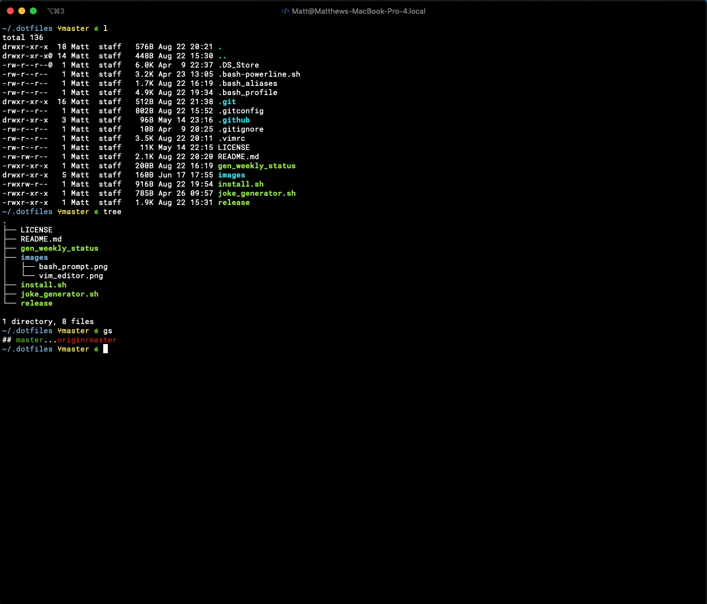
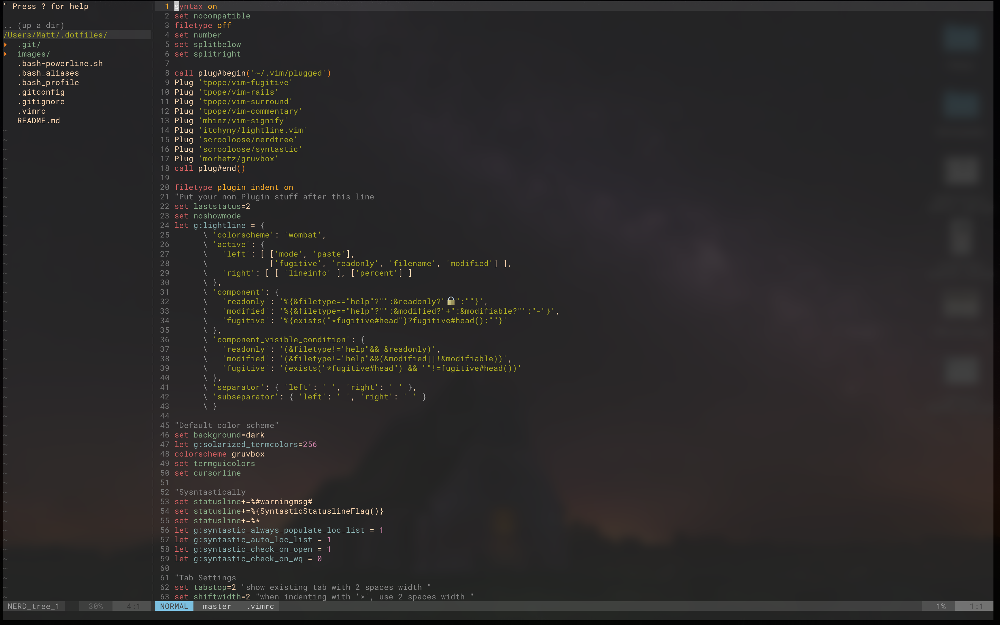

# .dotfiles
  
  
  
  
    

## Prerequisites
- MacOS/Linux
- [VimPlug](https://github.com/junegunn/vim-plug)
- [Powerline Fonts](https://github.com/powerline/fonts)
- [iTerm2](https://github.com/gnachman/iTerm2)
- [coreutils](https://formulae.brew.sh/formula/coreutils)
- [cowsay](https://formulae.brew.sh/formula/cowsay)
- [lolcat](https://formulae.brew.sh/formula/lolcat)
  
 
## Installation
1) Clone this project into your home directory
``` bash
git clone git@github.com:MatthewLaFalce/.dotfiles.git
```
2) Create symbolic links to .bash_profile, .vimrc, .gitconfig
``` bash
ln -s .dotfiles/.bash_profile
ln -s .dotfiles/.gitconfig
ln -s .dotfiles/.vimrc
```
3) Close and reopen terminal

## Screenshots
bash prompt



vim editor



## Sample Install Series
```bash
##Install vim plug
curl -fLo ~/.vim/autoload/plug.vim --create-dirs \ https://raw.githubusercontent.com/junegunn/vim-plug/master/plug.vim

##Powerline Fonts
#Clone
git clone https://github.com/powerline/fonts.git --depth=1
#Install
cd fonts
./install.sh
#Clean-up a bit
cd ..
rm -rf fonts
#May need to do other configurations to make the fonts visible in the terminal

##Install packages for bash welcome message
brew install coreutils
brew install cowsay
brew install lolcat
gem install lolcat

##Clone this git repo
git clone git@github.com:MatthewLaFalce/.dotfiles.git

##Create symbolic links to master files
ln -s .dotfiles/.bash_profile
ln -s .dotfiles/.gitconfig
ln -s .dotfiles/.vimrc
```
### Helpful Links
- [Colorful Cowsay Help](http://yjyao.com/2014/09/colorful-cowsay-in-your-terminal.html)
